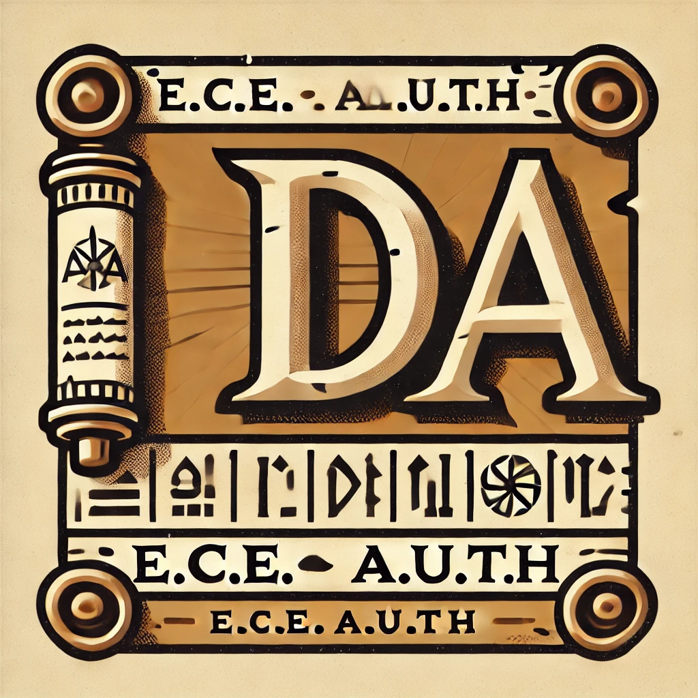

# Algorithm Design and Analysis
 
 
)

> Logo designed by AI: DALLE

This is the repository for the Algorithm Design and Analysis course, as it was taught in the 6th semester of E.C.E. A.U.Th.. Unfortunately, this was a team project whose burden was carried only by individuals. What meant to be fun resulted in almost-missed deadlines due to the unwillingness of people to do what they signed up for. The names shown in the project are:
- Chatziioannou Lamprinos
- Evangelidis Nikolas
- Filippidis Foivos-Panagiotis
